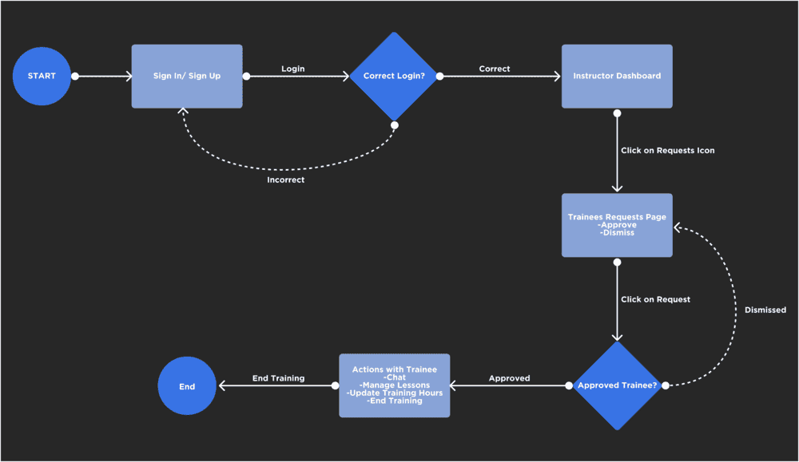
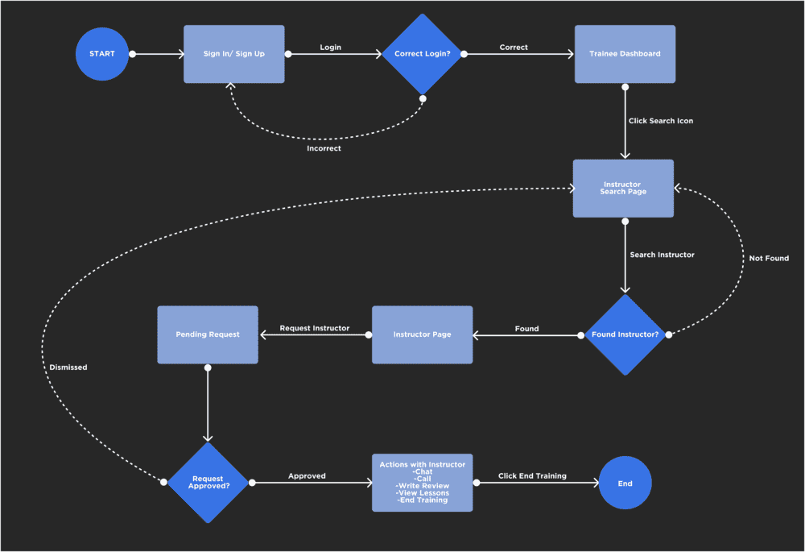

# Seyaqti App
Mobile App that automates the driving school process between instructors and trainees by offering multiple features including lesson scheduling, chat system, review system and search capabilities.

I developed this app as a part of my Bahrain Polytechnic studies (Coperate Learning Project) which was sponsored by Information and eGovernment Authority.

- [Application APK Link (Andriod)](https://drive.google.com/file/d/1bKbBRIVsD_czO-ZT967MQxX3DgBc2TZG/view?usp=sharing)

## Technology Used
- Flutter
- Firebase
- Enterprise Archetict
- Adobe Illustrator
- Figma

## Features
- Firebase (Authentication, Cloud Firestore, and Storage) 
- Notifications
- Lesson Scheduling
- Profile Management
- Chat System
- Review and Rating System
- Trainee Pages
    - Dashboard
    - Actions with Instructor
    - Lessons
    - Search Instructor
- Instructor Pages
    - Dashboard
    - Actions with Trainees
    - Lessons
    - Requests

## Prototype (Figma)
- [View Project](https://www.figma.com/file/57wXDqgtrMqY9QCCIcZwMG/Seyaqti?node-id=0%3A1&t=j2KPrJgSZ19N0HKF-1)
- [Run Prototype](https://www.figma.com/proto/57wXDqgtrMqY9QCCIcZwMG/Seyaqti?node-id=5-2&scaling=scale-down&page-id=0%3A1&starting-point-node-id=5%3A2)

## Designs
1. ERD

2. Design Class Diagram

3. Instructor Flow Diagram

4. Trainee Flow Diagram

## Project Issues
1. Instructors cannot reject requests from trainees.

    As of now, instructors are able to only accept the requests, or ignore them. The functionality of rejecting the trainee’s request is not added in the current version of the app due to the time constraint. It is possible to add the function by adding a reject button on each request that would delete them and send a notification to the trainees about the result.
2. Trainees cannot cancel their requests after sending them to instructors.

    The current version of the app only allows trainees to send one request at a time to instructors. This is especially problematic when trainees want to cancel their request, as that functionality has not been added to the app yet. The function could be easily added by implementing a way for trainees to keep track of their requests and make it possible for them to delete them when needed.
3. Notifications won’t work if the app is terminated.

    As for the current version of the app, the notifications won’t show when the app is fully terminated due to the limitations of the techniques used. They, however, will be able to show when the app is running in the background or foreground. To address this, a correct implementation of a notification API, such as Firebase Messaging, could be useful. Letting an API handle the notifications will let them work even when the app is terminated.
4. There are features in the app that are incomplete. 

    There are features that were marked "coming soon" because they weren’t finished in time due to the time constraint of the project. These features include settings, address changes, policies, and live tracking. More details are present in the Future Work section.
## Future Work

1. Request Rejection

    The app is already set up for this functionality to be added on the instructor side of things. It is similar to the "end training" feature that is in the app. There won't be any major modifications to the code to add this functionality, apart from adding a reject button to each request received within the instructor's requests page.

2. Request Cancelation

    Similar to the request rejection feature, the app and its code have the development tools in place for this functionality to be added. However, it is different from that feature because it is on the trainee side of the app. My recommendation for this feature is to add a new tab or page that displays the pending request, and on that page, a cancel button is placed near the request that would handle its deletion.

3. Firebase Messaging

    As explained before, the notification won't show while the app is terminated. I would suggest Firebase Messaging or a similar API to handle the notifications. This would come at the cost of major modifications to the current code. The whole notification system must be modified to handle receiving API responses and utilizing them to show local notifications on the users' devices.

4. Completing the Remaining Sections

    As discussed before, there are pages in the app that aren't done because they were put aside for the sake of the important features' completion. The remaining sections include the following:

    - Settings

        Settings should provide the ability for users to customize the app for their use, including theme changes and notification settings.

    - Address Change

        Address change can be done by allowing the users to change their location by displaying a map location picker.

    - Policies

        The policies section can be completed by adding the terms and conditions of the app's usage, which can be viewed with a click of a button.

    - Live Tracking

        I really wanted to add this feature as it seemed very interesting to develop, but because I couldn't due to the time constraints of the project, I would suggest that this be done in the future. I'd imagine this feature to be applied to the trainees' side of things, especially when the lessons include a pickup location. The trainees would be able to live track their instructors who are on their way to pick them up on a map, along with the duration left to reach them, similar to apps like Uber.
## Developed By
Mohamed Alalwan